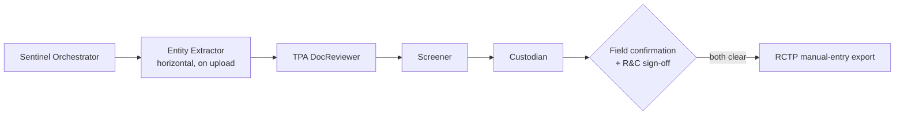
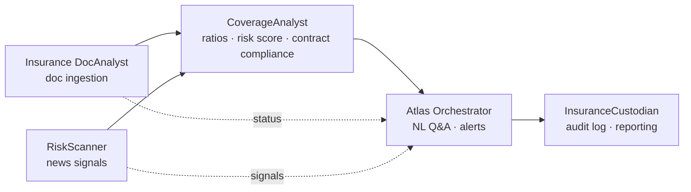
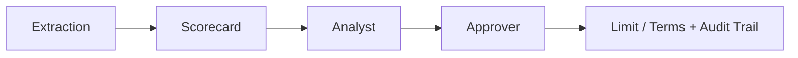

# risk-compliance

Agentic AI architecture for risk & compliance workflows — third-party onboarding/KYC, insurance portfolio monitoring, and trade credit assessment.

## Projects

| Project | Codename | What it does | Status |
|---|---|---|---|
| [`third-party-onboarding/`](third-party-onboarding) | **Sentinel** / KAI Sentinel | Chatbot host client + agent pipeline for third-party (TPA) onboarding, renewal, and FM&I (MAS-regulated) KYC — document extraction, sanctions/watchlist screening, and a manual-entry handoff to Dow Jones RCTP | Draft PRDs (TPA v9, FM&I KYC v1.8), agents in build |
| [`insurance-dashboard/`](insurance-dashboard) | **Atlas** | Conversational assistant + document-extraction pipeline for the Keppel Global Insurance Monitoring System — policy/broker document ingestion, ratio & risk scoring, contract requirements and exclusions registers | PRD v0.8, architecture plan v1.5 |
| [`credit-assessment/`](credit-assessment) | — | GUI + agentic backend for trade credit risk — extracts financials from customer statements, computes ratios and an internal credit rating, and routes a two-step analyst→approver limit/terms recommendation | PRD v0.10, working prototype |

## 🛡️ Sentinel — Third-Party Onboarding & KYC

Single chatbot surface (three-pane: chat / canvas / roster) that Requesters and R&C reviewers use to run TPA onboarding/renewal and FM&I KYC cases, backed by five agents writing to the platform's own record store — **not** a live integration with Dow Jones RCTP: `Sentinel` (orchestrator — coordinates the pipeline and synthesizes output, doesn't parse or call APIs itself), `Entity Extractor` (horizontal — runs on upload, before any pipeline, to pre-fill company name/UEN), `TPA DocReviewer` (the "Maker" — sole parser of every document set, resolves ownership structure in full), `Screener` (KYC/sanctions screening against the platform's own CSL data), `Custodian` (the "Checker" — portfolio governance, audit, and scheduled remediation forecasting).

- **Review, not create.** Agents pre-fill from source documents with per-field confidence and citations; a human confirms or amends every field. Judgment fields (PEP, beneficial ownership, sanctions exposure) are never guessed — left blank and flagged if the source doesn't state the answer.
- **Two blocking gates.** (1) field confirmation, (2) R&C sign-off on the Custodian audit report (screening recommendations + risk tier). No field export is generated for RCTP until both clear.
- **Screening is evidence, not verdicts.** The platform's own sanctions/watchlist screening (CSL) produces recommended classifications only; a human confirms every classification at sign-off.
- **FM&I KYC** runs as a second process on the same shell: a two-wave document chase (Wave 1 upfront, Wave 2 gated by CDD tier — Simplified/Standard/Enhanced), CTC (certified-true-copy) factual completeness detection, and human-gated rectification emails (deferred to v2).

Key docs: [Sentinel Host Client PRD](<third-party-onboarding/1. Planning & Prototyping/a. TPA/2. PRD v2/Sentinel Host Client - Product Requirements Document.md>) · [FM&I KYC PRD](<third-party-onboarding/1. Planning & Prototyping/b. FM&I KYC/Onboarding Host Client - FM&I KYC - Product Requirements Document.md>) · [Agentic Workflows](<third-party-onboarding/3. Agentic Workflows>)

## 📊 Atlas — Insurance Portfolio Monitoring

Five agents for the Keppel Global Insurance Monitoring System. `Atlas Orchestrator` handles intent routing, access-scope gating, cited answer composition, and the Action Items rail/alert dispatch — grounding every answer against `CoverageAnalyst`, a deterministic engine (no LLM, no judgment calls) that computes coverage/ratio KPIs, the composite risk score, and one merged Contract Requirements/Exclusions compliance status, gated by its own Config Change-Control workflow. `Insurance DocAnalyst` runs the document ingestion pipeline (intake → extract → validate → post) that feeds CoverageAnalyst; `RiskScanner` turns external news into confirmed, entity-linked risk signals (MVP baseline; impact scoring and appetite comparison are V2). `InsuranceCustodian` owns the audit log every write passes through, plus reporting/export (V2).

- **Answers only from live data, fully traceable** — every answer cites the record it came from; no answer ships without a citation.
- **Agents vs. deterministic workflows.** Only `Atlas Orchestrator`, `Insurance DocAnalyst`'s extraction step, and `RiskScanner` involve judgment calls; `CoverageAnalyst` and `InsuranceCustodian` are pure functions of their inputs — same inputs + config version always produce the same output.

Key docs: [Keppel_Atlas_PRD_v0_8.docx](<insurance-dashboard/1. Planning & Prototyping/Keppel_Atlas_PRD_v0_8.docx>) · [Atlas_Agent_Architecture_Plan.html](<insurance-dashboard/1. Planning & Prototyping/Atlas_Agent_Architecture_Plan.html>) · [Agents & Workflows](<insurance-dashboard/2. Agents & Workflows>)

## 💳 Credit Assessment — Trade Credit Risk

Internal tool for a credit/treasury team to assess trade customers' creditworthiness (accounts-receivable risk, not bank lending) from uploaded financial statements.

- Agentic extraction of standardized financial fields with confidence scoring; every field is human-confirmed (Confirmed / Amended / Not Present) before it feeds a ratio.
- Ratios compute even on unconfirmed inputs but are marked **Provisional**; submission is blocked while any Provisional result remains.
- Weighted scorecard → internal rating → proposed credit limit/terms, finalized through a two-step analyst→approver workflow with a full audit trail.
- V2: qualitative rating override, open-web adverse-media screening on the customer and named directors/UBOs/guarantors (evidence only, never an automatic score input — explicitly excludes sanctions/PEP screening).

Key docs: [Credit_Assessment_PRD_v0.10.md](<credit-assessment/1. Planning & Prototyping/Credit_Assessment_PRD_v0.10.md>) · [Credit_Assessment_Agent_Architecture_Plan.html](<credit-assessment/1. Planning & Prototyping/Credit_Assessment_Agent_Architecture_Plan.html>) · [Prototype](<credit-assessment/6. Prototype>)

## Repo conventions

- Each project folder follows its own numbered-stage layout (`1. Planning & Prototyping`, `2.`/`3. Agents & Workflows`, etc.) — see the project's own PRD for what each stage folder holds.
- `_Superseded/` subfolders hold prior versions kept for reference — not current.
- PRDs are living documents with an in-file changelog; read the changelog before the body to understand what's settled vs. open.

## Classification

Several documents in this repo (particularly under `credit-assessment/`) are marked **Confidential — Internal Use Only** by their own title block. Treat repo contents accordingly regardless of the repo's own visibility setting.
