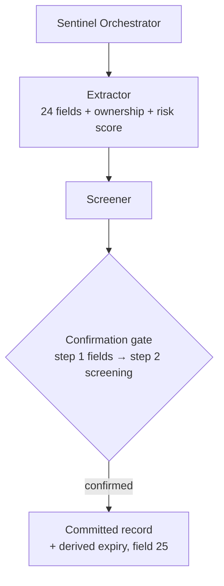
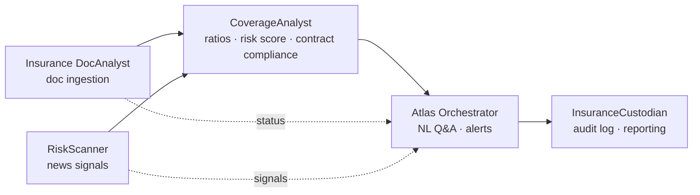
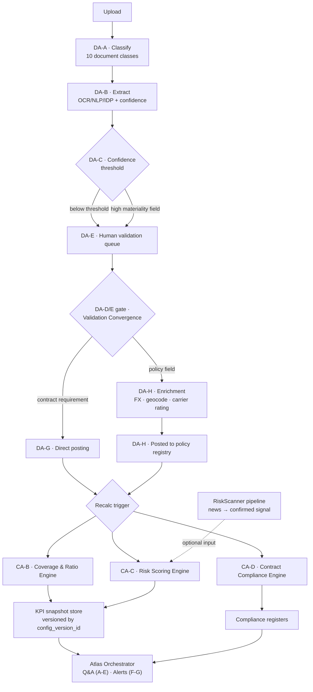
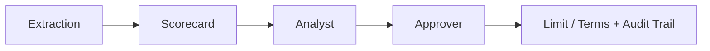
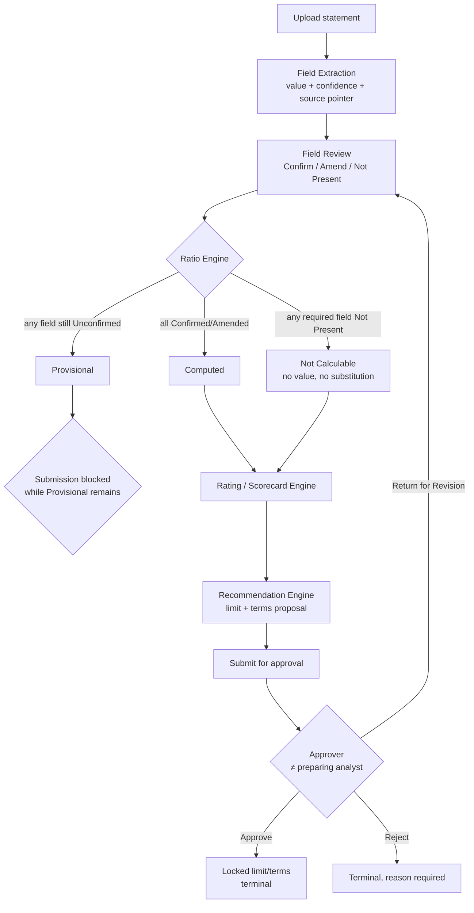

# risk-compliance

Agentic AI architecture for risk & compliance workflows — third-party onboarding, insurance portfolio monitoring, and trade credit assessment.


## Projects

| Project | Codename | What it does | Status |
|---|---|---|---|
| [`third-party-onboarding/`](third-party-onboarding) | **Sentinel** / KAI Sentinel | Chatbot host client + agent pipeline for third-party (TPA) onboarding and renewal — document extraction, real-arithmetic risk scoring, sanctions/watchlist screening, all committed to the platform's own record store | Draft PRD (TPA v10), agents in build |
| [`insurance-dashboard/`](insurance-dashboard) | **Atlas** | Conversational assistant + document-extraction pipeline for the Keppel Global Insurance Monitoring System — policy/broker document ingestion, ratio & risk scoring, contract requirements and exclusions registers | PRD v0.8, architecture plan v1.5 |
| [`credit-assessment/`](credit-assessment) | — | GUI + agentic backend for trade credit risk — extracts financials from customer statements, computes ratios and an internal credit rating, and routes a two-step analyst→approver limit/terms recommendation | PRD v0.10, working prototype |

## 🛡️ Sentinel — Third-Party Onboarding



Single chatbot surface (three-pane: chat / canvas / roster) that every signed-in user — one role, no reviewer tier — uses to find, onboard, renew, amend, and check TPA records, backed by three agents writing to the platform's own store. **No integration with Dow Jones RCTP of any kind**: Sentinel is the system of record: `Sentinel` (orchestrator — routes, holds state, sole caller of task tools), `Extractor` (the merged former DocAnalyst + DocReviewer — sole parser of every document set, resolves the 24-field schema, full ownership structure, and the risk score in one pass), `Screener` (sanctions/watchlist screening against the platform's own CSL data).

- **Review, not create.** The extractor pre-fills from source documents with per-field confidence and citations; a human confirms or amends every field. Judgment fields (PEP, beneficial ownership, sanctions exposure) are never guessed — left blank and flagged if the source doesn't state the answer.
- **One confirmation gate, two steps.** Step 1 confirms the 24 extracted fields (plus the derived 25th — expiry); step 2, unlocked once step 1 is confirmed, resolves every screening recommendation. Both write one log entry — there is no second, R&C-only sign-off gate.
- **Risk score is real arithmetic, not a label.** `interaction (highest of two selections) + services/industry + country score`, banded 0–7 Low / 8–12 Medium / 13+ High — shown with its working at the gate, and it sets screening scope (Low: entity+CEO · Medium: +directors+parent · High: +UBOs).
- **A HIGH-tier record can't commit with an unresolved ownership chain.** The UBO table always shows every evidenced shareholding; if the beneficial-owner conclusion itself can't be resolved and UBOs are in scope, commit blocks until the user supplies a document or states the owner themselves (logged as human-supplied, then screened).
- **Amend, for correcting a committed record** without running a full renewal — re-tiers and re-screens if a scoring or identity field changes, appends a new version to the same record, never overwrites history.
- **Screening outages park the draft, never strand the user** — confirmed work is kept, screening retries in the background, and the user is notified rather than blocked with no path forward.

Key docs: [Sentinel Host Client PRD (v10)](<third-party-onboarding/1. Planning & Prototyping/a. TPA/3. PRD v3/Sentinel Host Client - Product Requirements Document.md>) · [Agent prompts (v3)](<third-party-onboarding/3. Agentic Workflows/a. TPA/3. TPA Prompts v3>)

<details>
<summary><strong>🤖 Agents & subagents</strong></summary>

Three agents share the host-client shell, each writing to the platform's own record store. Only the Orchestrator is allowed to call platform task tools — every other agent is provisional-output-only.

| Agent | Purpose | Flows it participates in |
|---|---|---|
| **Sentinel (Orchestrator)** | Routing, state, sole caller of TPA task tools; owns the two-step confirmation gate and the confirmation log | Flow A–E (all TPA flows) |
| **Extractor** | The merged former Entity Extractor + TPA DocReviewer — sole parser of every document set: 24-field schema, full (multi-layer) ownership resolution, renewal deltas, and the risk-score arithmetic (feeding derived expiry, field 25) in one pass, no intermediate handoff | Flow B (Onboard/Renew), Flow E (Amend) |
| **Screener** | Screens the resolved party list against sanctions/watchlist/PEP/adverse-media sources at whatever scope the risk tier sets; produces recommended classifications only, resolved by the human at the gate; re-invoked on an identity edit or a tier rise | Flow B (post-extraction screening); re-screen branches in the gate (§5) and Flow E |

</details>

<details>
<summary><strong>🔀 Workflow flows</strong></summary>

Sentinel Orchestrator owns 5 named flows — down from 9, after cutting the R&C-only journeys (exception report, due-for-renewal list, screening-proposal routing, R&C review/clearance) and the scheduled Custodian sweep to Phase 2:

- **A — Identity Resolution.** Two-key match only (exact registration/tax ID, or name+country) against the portfolio registry — shared registered address/parent was deliberately dropped as a match key (too many false positives from corporate-secretarial registration addresses). A "none of these" option on a multiple-candidate result proceeds as a confirmed new onboarding.

- **B — Onboard / Renew.** The core pipeline: extraction, screening, then one two-step gate, then commit.

  ```mermaid
  flowchart TD
      B1["B1 · Extractor<br/>24 fields + ownership + risk score"] --> B2["B2 · Screener<br/>scope set by risk tier"]
      B2 --> B3{"B3 · Gate step 1<br/>confirm fields"}
      B3 --> B4{"B4 · Gate step 2<br/>confirm screening"}
      B4 -->|identity edit| B2
      B4 -->|scoring-field edit, tier rises| B2
      B4 -->|confirmed| B5["B5 · Commit<br/>+ derived expiry (field 25)"]
  ```

- **C — Record Status.** Read-only card: risk score/tier, status, screening outcome, expiry + days remaining, and a `HAS OPEN ITEMS` flag naming any blank mandatory field, unconfirmed judgment field, or overridden screening recommendation.

- **D — Review Pack.** Field · Value · Source · Confidence · **Source match** (`agrees`/`differs`/`no source`, set at extraction) · **Edited?** (from the confirmation log). Available to every user, not gated to a reviewer role.

- **E — Amend.** Corrects a committed record's own values — not a renewal, no expiry reset. A scoring-field edit re-tiers and screens newly in-scope parties; an identity edit re-screens that party; commits a new version on the same record ID, never overwriting history.

**Design rules across all five flows:** **no fabrication** (Low-confidence or uncited judgment fields — PEP, UBO conclusion, sanctions exposure — are left blank, never guessed, though the *evidenced* shareholding facts behind a UBO conclusion are always shown even when the conclusion itself is blocked); **one gate, fully logged** (field changes, screening decisions, actor, and timestamp all land in one `confirmation_log` entry per commit); and **only the Orchestrator calls a task tool** — every other agent's output is provisional until confirmed.

</details>

<details>
<summary><strong>🗄️ State management</strong></summary>

- **One record store**, owned entirely by the platform: `app:portfolio_registry`. There is no external system to sync from or hand off to — commit is the terminal write, not a staging step toward RCTP.
- **Resumable in-flight drafts**: `app:inflight_drafts` holds uploaded documents and partial edits, keyed to user identity (not device/session), with no automatic expiry — cleared only on commit or explicit discard.
- **`screening_state`** (`COMPLETE` / `RUNNING` / `PARKED — RETRYING` / `PARKED — UNAVAILABLE`) gates commit directly — anything but `COMPLETE` blocks it. A screening outage parks the draft and retries indefinitely rather than failing the session; a sustained failure escalates visibly in the roster rather than retrying silently forever.
- **`extracted_parties` is the single store for party data** — the Directors/UBO/Other-Entities field tables are views onto it, not separate copies, so an identity edited from the screening panel and a field edited in the draft can never disagree.
- **Confidence model**: two states, Confident / Needs checking (down from three) — a Needs-checking judgment field is always left blank + flagged, never guessed; a Needs-checking factual field is pre-filled but visibly flagged.
- **The UBO field is split, not one Judgment field**: the evidenced ownership facts are Factual and always populated; only the beneficial-owner *conclusion* is Judgment and can be left open with the breaking layer named — which is what lets a HIGH-tier commit block on an unresolved conclusion without ever hiding the evidence that was found.
- **The risk tier is derived state, recomputed on any edit to its three inputs** (country, services, interaction) at the gate or in Amend — a tier rise re-screens the newly in-scope parties before commit; a tier fall keeps the screening already done.
- **Expiry (field 25) is computed, not extracted** — commit date plus the RC003 cadence for the confirmed tier (Low 5y / Medium 3y / High 1y), user-overridable with the override logged distinctly from the derived value.
- **Audit trail**: every populated field carries a confidence score, a source-match assertion, and a source-location citation; the `confirmation_log` written at every gate/Amend commit is the audit artifact — field-level diffs, screening decisions with override rationale, actor, and timestamp — surfaced on the record as its own history tab.

</details>

## 📊 Atlas — Insurance Portfolio Monitoring



Five agents for the Keppel Global Insurance Monitoring System. `Atlas Orchestrator` handles intent routing, access-scope gating, cited answer composition, and the Action Items rail/alert dispatch — grounding every answer against `CoverageAnalyst`, a deterministic engine (no LLM, no judgment calls) that computes coverage/ratio KPIs, the composite risk score, and one merged Contract Requirements/Exclusions compliance status, gated by its own Config Change-Control workflow. `Insurance DocAnalyst` runs the document ingestion pipeline (intake → extract → validate → post) that feeds CoverageAnalyst; `RiskScanner` turns external news into confirmed, entity-linked risk signals (MVP baseline; impact scoring and appetite comparison are V2). `InsuranceCustodian` owns the audit log every write passes through, plus reporting/export (V2).

- **Answers only from live data, fully traceable** — every answer cites the record it came from; no answer ships without a citation.
- **Agents vs. deterministic workflows.** Only `Atlas Orchestrator`, `Insurance DocAnalyst`'s extraction step, and `RiskScanner` involve judgment calls; `CoverageAnalyst` and `InsuranceCustodian` are pure functions of their inputs — same inputs + config version always produce the same output.

Key docs: [Keppel_Atlas_PRD_v0_8.docx](<insurance-dashboard/1. Planning & Prototyping/Keppel_Atlas_PRD_v0_8.docx>) · [Atlas_Agent_Architecture_Plan.html](<insurance-dashboard/1. Planning & Prototyping/Atlas_Agent_Architecture_Plan.html>) · [Agents & Workflows](<insurance-dashboard/2. Agents & Workflows>)

<details>
<summary><strong>🤖 Agents & subagents</strong></summary>

Five agents, each a merged consolidation of what was originally ~12 finer-grained functions. Only three involve genuine judgment calls (Orchestrator, DocAnalyst's extraction step, RiskScanner) — CoverageAnalyst and InsuranceCustodian are deterministic, no-LLM, pure functions of their inputs plus the live config version.

| Agent | Description | Flows it participates in |
|---|---|---|
| **Atlas Orchestrator** | Always-on assistant panel answering NL questions on coverage, sites, renewals, risk, and contractual requirements from live data — always with a citation, with an explicit no-answer fallback rather than a guess. Also owns Alerts & Action Items (absorbed function): evaluates the trigger table and feeds both the pull-based rail and push-based dispatch. Never writes policy/coverage/requirement/exclusion data | A Intent & Page-Context Routing · B Access-Scope Gate · C Grounding Fan-Out · D Answer Composition & Citation · E No-Answer Fallback · F Trigger Evaluation & Action Items · G Alert Dispatch; plus Alert Resolution |
| **Insurance DocAnalyst** | The entire document ingestion pipeline: intake/classify (10 document classes), OCR/NLP/IDP extraction (the one truly agentic sub-step), confidence-routed human review, manual-questionnaire maker-checker fallback, enrichment (FX/geocode/carrier-rating/entity-site mapping) and posting. Sole writer of the policy registry and contract-requirement inputs | A Intake & Classification · B Extraction · C Confidence-Threshold Routing · D Manual Questionnaire · E Human Validation · F Reprocessing · G Contract-Requirement Direct Posting · H Enrichment & Posting |
| **CoverageAnalyst** | Deterministic (no LLM). Four merged functions, each a pure function of inputs + current config version: Coverage & Ratio Engine (all KPIs), Risk Scoring Engine (composite 0–100 score + drivers), Contract Compliance Engine (requirement-vs-placed + exclusion override, one merged status), and Config Change-Control (the sole governance path for thresholds/weights) | A Config Change-Control (Propose→Review→Approve→Version) · B KPI Computation · C Risk Score Computation · D Requirement Comparison / Exclusion Cross-Check |
| **InsuranceCustodian** | Two deterministic/infra functions: Reporting & Export (Board pack, renewal forecast, coverage-gap register, audit lineage report) and Audit & Access Log (immutable append-only log every other component writes through — structurally no UPDATE/DELETE path). Also hosts the RBAC matrix and data-lifecycle/retention rules | A Report Generation · B Append-Only Audit Write |
| **RiskScanner** | Turns unstructured external news into classified, entity-linked, human-confirmed risk signals — decision-support only, never writes a policy/coverage/requirement/exclusion record. Sole writer of news signals, consumed as an optional weighted input by CoverageAnalyst's Risk Scoring function | Single pipeline: Sector/Geo Filter → Classification → Entity Linking → (Stretch: Impact Scoring, Appetite Comparison) → mandatory human Confirm/Dismiss gate; plus a signal-correction path |

</details>

<details>
<summary><strong>🔀 Workflow flows</strong></summary>



Node prefixes match the flow letters in the Agents table above: `DA-` = Insurance DocAnalyst, `CA-` = CoverageAnalyst. Orchestrator's Q&A/Alerts steps and InsuranceCustodian aren't broken out node-by-node — they sit downstream of this compute pipeline, at the `O` node.

- **Q&A flow (Orchestrator A–E):** question + page context → intent classification → access-scope gate (filters the *request* before any grounding call) → grounding fan-out to CoverageAnalyst/RiskScanner/DocAnalyst → citation assembly + answer composition, gated by **Answer Convergence** = scope ∧ grounding results ∧ citations → if unmet, an explicit fallback, never a guess. *(Enters at the `O` node above.)*
- **Alerts flow (Orchestrator F–G):** nine named triggers (renewal due, coverage gap, low-confidence extraction, carrier downgrade, aggregate erosion, new hotspot, appetite breach, contractual gap, exclusion conflict — four ship MVP, five are V2) evaluated against KPI/compliance/news state → risk-acceptance override check → access-scope filter → recipient/channel routing → dedup → alert raised + audited. Resolution is either automatic (the underlying condition clears) or a human risk-acceptance override with mandatory commentary. *(Also the `O` node above.)*
- **Document pipeline (DocAnalyst A–H):** shown above as nodes `DA-A`–`DA-H` — intake/classify → extract → confidence-gated routing (plus a mandatory high-materiality cross-check regardless of confidence) → human validation or maker-checker questionnaire fallback → branch to contract-requirement direct posting or full enrichment → versioned post to the policy registry, gated by **Posting Convergence** = Validation Convergence ∧ enrichment succeeded ∧ audit entry written. *(Flow F Reprocessing loops back into `DA-B` and isn't drawn separately.)*
- **CoverageAnalyst A–D:** nodes `CA-B`–`CA-D` above compute from the `Recalc trigger` gate; `CA-A` Config Change-Control is the sole path that can change KPI thresholds/risk weights/appetite thresholds (Propose→Review→Approve→Version, never edits in place) — a separate governance workflow, not part of this live compute diagram. Every downstream KPI/risk-score/compliance write is stamped with the config version live at compute time, gated by **Snapshot Convergence**.
- **RiskScanner:** the `N` node above — filter by sector/geo → classify by peril/severity → link to an entity/site → (stretch) impact score + appetite comparison → held PENDING for a mandatory human Confirm/Dismiss, gated by **Signal Convergence** — only Confirmed signals become an optional Risk Scoring input; a correction supersedes a prior Confirmed signal rather than overwriting it.
- **InsuranceCustodian:** not part of this diagram (it consumes the snapshots after the fact) — Report Generation (V2, four report types, all read-only, sourced from the KPI/risk/compliance snapshots) and Audit & Access Log (every write from any component passes through it — MVP, live from day one).

</details>

<details>
<summary><strong>🗄️ State management</strong></summary>

- **Bitemporal model** — every non-reference record carries both *valid-time* (when the fact was true in the real world) and *transaction-time* (when Atlas recorded/corrected it), so Atlas can answer both "what was true on date X" and "what did we believe on date X vs. now." Applies to versioned entities (Asset, Policy, Coverage/Line, Premium, ExtractionField, Third-Party Requirement, Policy Exclusion, News Signal — Type-2 SCD, a correction closes the old row and inserts a new one, never mutates in place).
- **Point-in-time snapshots**: KPI/Risk Score results are an additive fact table keyed by `(entity, metric, as_of_date, config_version_id)` — recompute always inserts, never updates, so a later reweighting can never rewrite history.
- **Config-version gating**: Configuration Version records (`version_id`, `effective_from`, `superseded_by`, `rationale`, `approved_by`, `threshold_set`) are the sole product of CoverageAnalyst's Config Change-Control state machine. Every KPI/risk-score write requires a bound `config_version_id` before it can be written at all — the structural enforcement of "historical values retain the weights/thresholds in effect when calculated."
- **Convergence gates**, one per writing flow, all boolean-and of populated state + explicit status: **Validation Convergence** (DocAnalyst), **Posting Convergence** (the sole gate on writing the policy registry), **Answer Convergence** (Orchestrator), **Snapshot Convergence** (CoverageAnalyst), **Signal Convergence** (RiskScanner).
- **Structural, not conventional, write restrictions**: the policy registry has exactly one writer (DocAnalyst's enrichment/posting step) enforced at the DB-grant level, not just by convention; the audit log is append-only with no UPDATE/DELETE grant for any role, including Admin.
- **Compliance status** is one merged field per requirement (`Met`/`At-risk`/`Gap`/`Excluded`) — the `Excluded` override is always applied *after*, never instead of, the numeric requirement-vs-placed comparison, avoiding any race between the two.
- **Retention**: four independent clocks (renewal-cycle, regulatory-retention, audit — effectively permanent, never pruned, and migration) — archiving waits for the longer of renewal-cycle and regulatory-retention.
- **RBAC is currently stubbed at MVP**: permission checks always-allow during closed testing; only identity resolution and audit attribution stay live. Must be re-enabled before wider rollout.

</details>

## 💳 Credit Assessment — Trade Credit Risk



Internal tool for a credit/treasury team to assess trade customers' creditworthiness (accounts-receivable risk, not bank lending) from uploaded financial statements.

- Agentic extraction of standardized financial fields with confidence scoring; every field is human-confirmed (Confirmed / Amended / Not Present) before it feeds a ratio.
- Ratios compute even on unconfirmed inputs but are marked **Provisional**; submission is blocked while any Provisional result remains.
- Weighted scorecard → internal rating → proposed credit limit/terms, finalized through a two-step analyst→approver workflow with a full audit trail.
- V2: qualitative rating override, open-web adverse-media screening on the customer and named directors/UBOs/guarantors (evidence only, never an automatic score input — explicitly excludes sanctions/PEP screening).

Key docs: [Credit_Assessment_PRD_v0.10.md](<credit-assessment/1. Planning & Prototyping/Credit_Assessment_PRD_v0.10.md>) · [Credit_Assessment_Agent_Architecture_Plan.html](<credit-assessment/1. Planning & Prototyping/Credit_Assessment_Agent_Architecture_Plan.html>) · [Prototype](<credit-assessment/6. Prototype>)

<details>
<summary><strong>🤖 Agents & subagents</strong></summary>

Five agents own the 13-component roster — grouped in the architecture plan (v2.3) to match the five-agent shape Sentinel and Atlas already use; the regrouping moved no boundary. A **sixth agent is specified but not yet built** (read-only Q&A assistant, backed by FR13 in the PRD, v0.12 — eleven sub-requirements, structured-query-only grounding). Despite the "GUI + agentic backend" framing, only **one owned component is a pure agent** (Agent 4's open-web screening) and **one is a hybrid** (Agent 1's extraction step) — the other eleven are deterministic workflows/infrastructure, kept away from the ratio/rating math by design so every rating stays reconstructable. Listed with what each owns; the deterministic majority is included because the flows below depend on them.

| Agent | Owns (component · type) | Description | Flows it participates in |
|---|---|---|---|
| **Statement Extraction** | Document Intake & Versioning (workflow) · Field Extraction & Validation Routing (**hybrid**) | The ingest pipeline: virus-scan/encrypt/version a statement, then extract standardized financial fields with value/confidence/source-pointer per field — the one agentic step at MVP, with a deterministic routing floor beneath it that never auto-accepts. Also extracts director/UBO/guarantor candidates (V2). Holds MVP's only evaluation harness | Document-to-decision pipeline (intake + extraction); copy-on-reuse; screening-subject candidate extraction (V2) |
| **Field Review** | Field Review, Confirmation & Posting (workflow) | The human confirmation gate — the only legitimate path into a ratio. Field × period grid: Confirm/Amend/Not Present per cell, bulk-confirm-all-High, amendment history, currency normalization, versioned write and recompute trigger, all in one transaction | Financial field review & confirmation; recompute-on-amendment; re-entry on "Return for Revision" |
| **Scoring & Decisioning** | Ratio Engine · Rating / Scorecard Engine · Recommendation Engine (all workflow) | The three deterministic, strictly-sequential engines: ratios (Provisional/Not-Calculable-gated) → weighted scorecard → internal rating → limit/terms proposal. All read a versioned methodology config and compute-on-write, stamping the config version so historical assessments are never rescored | Ratio computation & gating; period-over-period trend; rating/scorecard; limit/terms recommendation & override |
| **Adverse-Media Screening** (V2) | Screening Subject Register & Review (workflow) · Adverse Media Screening (**pure agent**) | The whole open-web screening domain: a customer-level roster of directors/UBOs/guarantors with human Confirm/Amend/Not-Present review, feeding the one pure LLM agent that searches the open web once ratios finish computing, disambiguates namesakes, judges adversity, and scores relevance. Findings never touch a computation — only human-reviewed and optionally cited as rating justification. Excludes sanctions/PEP by design | Screening-subject capture & review; adverse-media screening (post-ratio trigger → search → human review → optional citation) |
| **Governance & Records** | Approval Workflow · Customer & Assessment Registry (infra) · Audit & Access Log (infra) · Methodology Config & Change-Control · Reporting & Export | Everything that decides, records, configures, and exports: the two-step analyst→approver state machine (approver ≠ preparer); the Customer master data + append-only assessment-version chain that also owns the New/Refresh entry point, cross-assessment comparison, and Browse History mode; the immutable audit log every component writes through; versioned methodology config; and read-only PDF/Excel export | Approval flow & SoD; assessment entry point; cross-assessment comparison; Browse History → detail → drill-down/trend/documents → browse-to-refresh; audit logging (cross-cutting); versioned config supply; export |
| **Assistant / Q&A Orchestrator** (FR13, Should/V2, not yet built) | Conversational Query & Answer (**pure agent**, read-only) | *Specified, not yet built.* A chat surface for users to ask about an assessment: what a ratio is and how it was computed, what drove the rating, where the case sits in the workflow, the proposed/approved limit, and how this cycle compares to the last. The roster's **second pure agent** — interprets open-ended intent, which none of the five deterministic-or-single-purpose agents can. **Read-only by hard rule**: composes cited answers from Agents 3 and 5's stored outputs (and, once FR12 ships, Agent 4's Relevant findings) under the caller's RBAC scope, holds no write path, triggers no computation, advances no state — so it can't bypass the human review gate or segregation of duties. Grounded through fixed, parameterized queries only — no free-text or vector search — so every citation is verifiable by construction. Any action a user asks for pre-fills and navigates into the existing gated flow (the browse-to-refresh pattern), never executes it | Q&A over ratios/rating drivers/case status/history/comparison/screening (read-only); navigate-into-flow hand-off |

</details>

<details>
<summary><strong>🔀 Workflow flows</strong></summary>



- **Document-to-decision pipeline (core path):** upload → extraction with confidence scoring → mandatory review below-threshold → Confirm/Amend/Not Present per field-period cell → Ratio Engine computes on every value-bearing field regardless of confirmation status → Rating/Scorecard → Recommendation (analyst may override with justification) → submit, blocked while any ratio is Provisional.
- **Provisional / Not Calculable gating:** a Not-Present required input always wins — the ratio has no value, no substitution, ever, and this doesn't block submission (it's a completed review outcome). An Unconfirmed-but-present input makes the ratio Provisional, which *does* block submission. The two flags are mutually exclusive and must never render alike.
- **Two-step analyst→approver flow:** Draft → Submitted (only visible to a different user than the preparer) → Approve (locks final terms, terminal) / Reject (terminal, reason required) / Return for Revision (not a stored fifth state — modeled as "Draft whose most recent decision was Return"; re-enters at Field Review). Each decision appends one record; a returned-then-resubmitted assessment accumulates decisions rather than overwriting them.
- **New vs. Refresh entry point:** zero prior assessments for a customer → New (empty field scope); one or more → Refresh (select a source, default most recent). Refresh mints the new assessment version *before* copying anything, then copies the source's most-recent extraction into the new assessment's own scope — but every copied field resets to Unconfirmed, so one assessment's review can never silently satisfy another's confirmation gate.
- **Cross-assessment comparison:** only available once the new assessment's own engines have computed (never triggers a recompute on read); a ratio/rating/recommendation Provisional or Not Calculable on *either* side of the comparison suppresses that line with a stated reason rather than showing a misleading delta; a differing config version between the two is flagged, never hidden.
- **Browse History mode:** a peer top-level mode (not nested in Prepare) — role-scoped customer directory → detail view assembling trend, drill-down (read-only, never reopens for editing), and document history → a gated "Refresh this customer" action routes back into the Prepare-mode Refresh flow.
- **Screening flow (V2):** fires once ratios finish computing (not at submission, so findings exist before the rating-justification window closes) → agent searches and judges adversity/relevance per subject → every finding routed to a human for Relevant/Not Relevant/Needs Follow-up → only Relevant findings may be cited as rating-override justification; a `ScreeningRun` is written even on zero findings so "clean" is distinguishable from "not yet run."

</details>

<details>
<summary><strong>🗄️ State management</strong></summary>

- **Single, non-branching assessment lifecycle**: Draft → Submitted → Approved | Rejected | Returned. New and Refresh differ only in how Draft's field scope is populated, then converge onto the same machine. Approved/Rejected are terminal; Returned re-enters Draft and is *derived*, not stored, as "Draft whose most recent approval decision was Return" — resolving an inconsistency in the PRD's own five-state description.
- **Field-level states**: Unconfirmed → Confirmed / Amended / Not Present. `Not Present` is a deliberate third terminal outcome (added to close a real deadlock where a genuinely-absent line item on an unaudited statement could never exit "Unconfirmed forever, Provisional forever, submission blocked forever").
- **Provisional vs. Not Calculable** (mutually exclusive ratio flags): Not Present in any required input always wins regardless of other inputs' status and yields no stored value; Provisional applies only once every input exists but at least one is still Unconfirmed. Provisional blocks submission and bars the rating from the Recommendation Engine; Not Calculable blocks neither.
- **Field state never crosses an assessment boundary**: `ExtractedField` belongs to the Assessment, not the Document — reusing a document across assessments copies its fields into the new assessment's own scope and resets every copy to Unconfirmed. Five read-only exceptions (within-assessment trend, prior-assessment drill-down, summary trend, document browse, cross-assessment comparison) read across the boundary without ever writing across it. `ScreeningSubject` is the one deliberate exception — it belongs to the Customer and is shared across every assessment, since a director is a fact about the entity, not about one review cycle.
- **Compute-on-write, never on read**: Ratio, Rating, and Recommendation are written once per compute/recompute, each stamped with the config version live at that moment — a later methodology change never retroactively rescopes a historical assessment.
- **Segregation-of-duties gate**: enforced at both submission and decision time — an approver who is also the preparing analyst is refused, not just discouraged.
- **Persistence discipline**: "an evidence file, not a task tracker" — nearly everything is immutable once written (Document versions, Ratio/Rating/Recommendation snapshots, the append-only Audit Log); the only genuinely mutable states are short-lived human-review steps (field status; V2 screening-subject and finding-review status). The current prototype implements this as an in-memory store, explicitly flagged as a frontend stand-in for real persistence.
- **Open state-model questions** (documented, not yet decided): whether a customer can be refreshed while a prior assessment is still in-flight; whether refresh source selection should be restricted to the most-recent assessment only; how far the Auditor's browse scope should extend beyond completed assessments.

</details>

## Repo conventions

- Each project folder follows its own numbered-stage layout (`1. Planning & Prototyping`, `2.`/`3. Agents & Workflows`, etc.) — see the project's own PRD for what each stage folder holds.
- `_Superseded/` subfolders hold prior versions kept for reference — not current.
- PRDs are living documents with an in-file changelog; read the changelog before the body to understand what's settled vs. open.

## Classification

Several documents in this repo (particularly under `credit-assessment/`) are marked **Confidential — Internal Use Only** by their own title block. Treat repo contents accordingly regardless of the repo's own visibility setting.
