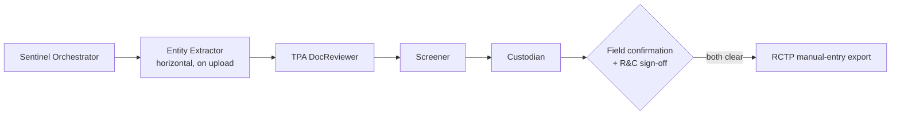
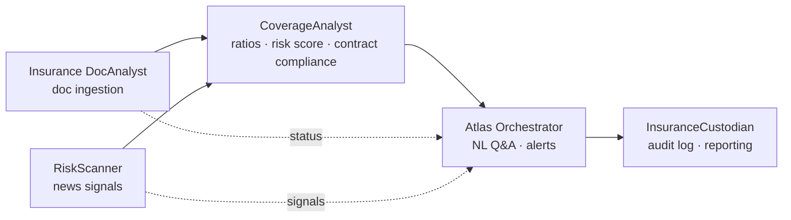
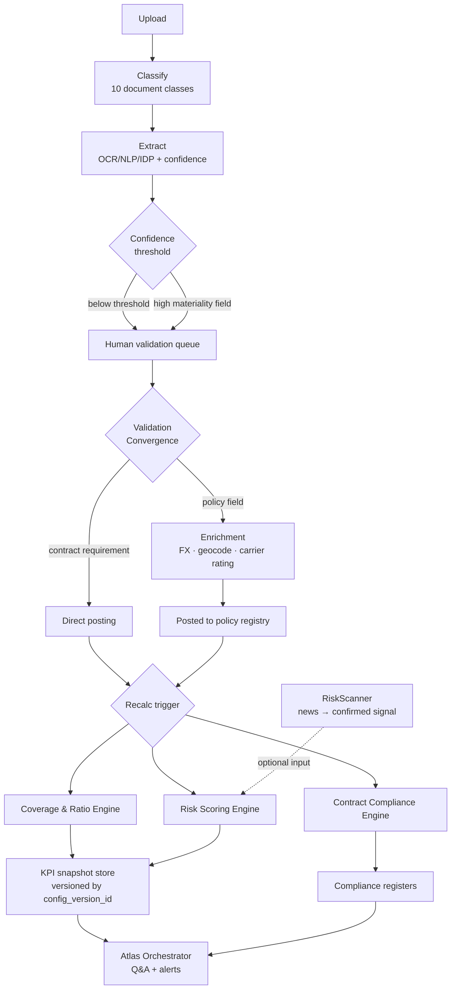
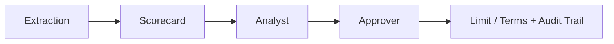
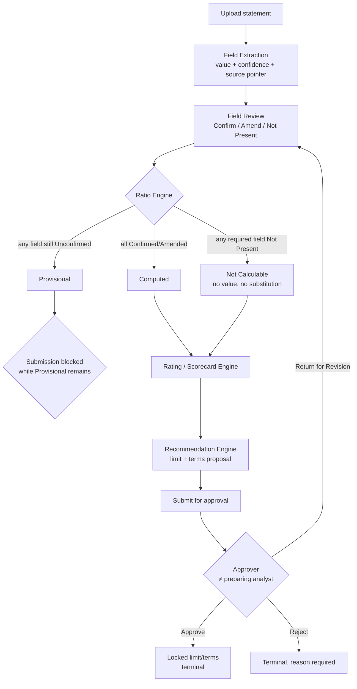

# risk-compliance

Agentic AI architecture for risk & compliance workflows — third-party onboarding/KYC, insurance portfolio monitoring, and trade credit assessment.

## Projects

| Project | Codename | What it does | Status |
|---|---|---|---|
| [`third-party-onboarding/`](third-party-onboarding) | **Sentinel** / KAI Sentinel | Chatbot host client + agent pipeline for third-party (TPA) onboarding, renewal, and FM&I (MAS-regulated) KYC — document extraction, sanctions/watchlist screening, and a manual-entry handoff to Dow Jones RCTP | Draft PRDs (TPA v9, FM&I KYC v1.8), agents in build |
| [`insurance-dashboard/`](insurance-dashboard) | **Atlas** | Conversational assistant + document-extraction pipeline for the Keppel Global Insurance Monitoring System — policy/broker document ingestion, ratio & risk scoring, contract requirements and exclusions registers | PRD v0.8, architecture plan v1.5 |
| [`credit-assessment/`](credit-assessment) | — | GUI + agentic backend for trade credit risk — extracts financials from customer statements, computes ratios and an internal credit rating, and routes a two-step analyst→approver limit/terms recommendation | PRD v0.10, working prototype |

## 🛡️ Sentinel — Third-Party Onboarding & KYC

Single chatbot surface (three-pane: chat / canvas / roster) that Requesters and R&C reviewers use to run TPA onboarding/renewal and FM&I KYC cases, backed by five agents writing to the platform's own record store — **not** a live integration with Dow Jones RCTP: `Sentinel` (orchestrator — coordinates the pipeline and synthesizes output, doesn't parse or call APIs itself), `Entity Extractor` (horizontal — runs on upload, before any pipeline, to pre-fill company name/UEN), `TPA DocReviewer` (the "Maker" — sole parser of every document set, resolves ownership structure in full), `Screener` (KYC/sanctions screening against the platform's own CSL data), `Custodian` (the "Checker" — portfolio governance, audit, and scheduled remediation forecasting).

- **Review, not create.** Agents pre-fill from source documents with per-field confidence and citations; a human confirms or amends every field. Judgment fields (PEP, beneficial ownership, sanctions exposure) are never guessed — left blank and flagged if the source doesn't state the answer.
- **Two blocking gates.** (1) field confirmation, (2) R&C sign-off on the Custodian audit report (screening recommendations + risk tier). No field export is generated for RCTP until both clear.
- **Screening is evidence, not verdicts.** The platform's own sanctions/watchlist screening (CSL) produces recommended classifications only; a human confirms every classification at sign-off.
- **FM&I KYC** runs as a second process on the same shell: a two-wave document chase (Wave 1 upfront, Wave 2 gated by CDD tier — Simplified/Standard/Enhanced), CTC (certified-true-copy) factual completeness detection, and human-gated rectification emails (deferred to v2).

Key docs: [Sentinel Host Client PRD](<third-party-onboarding/1. Planning & Prototyping/a. TPA/2. PRD v2/Sentinel Host Client - Product Requirements Document.md>) · [FM&I KYC PRD](<third-party-onboarding/1. Planning & Prototyping/b. FM&I KYC/Onboarding Host Client - FM&I KYC - Product Requirements Document.md>) · [Agentic Workflows](<third-party-onboarding/3. Agentic Workflows>)

<strong>🤖 Agents & subagents</strong>

Two sibling agent sets share the host-client shell: **TPA** (onboarding/renewal) and **FM&I KYC**. Each has its own Orchestrator, its own "Maker" (DocReviewer) and "Checker" (Custodian); only the Orchestrator in each set is allowed to call platform task tools — every other agent is provisional-output-only.

| Agent | Set | Purpose | Flows it participates in |
|---|---|---|---|
| **Sentinel (TPA Orchestrator)** | TPA | User-facing interface, intent routing, identity resolution, sole caller of TPA task tools; aggregates the other agents' output into an executive report | Flow A–I (all TPA flows) |
| **Entity Extractor / Doc Analyst** (horizontal) | Shared | Fast, non-judgmental first-pass extractor that runs on every upload before any pipeline starts; extracts entity IDs, key persons, contract terms verbatim with value/confidence/locator — never infers risk | TPA Flow B (feeds TPADocReviewer); KYC Flow B & D (feeds KYC DocReviewer) |
| **TPA DocReviewer (the "Maker")** | TPA | Sole parser of TPA document sets — maps content to the 24-field schema, resolves full (multi-layer) ownership structure to natural persons, computes renewal deltas, runs gap analysis | Flow B (Ingestion & Renewal Delta Analysis) |
| **Screener (KYC & Sanctions Screening Agent)** | TPA | Screens the fully-resolved party list against sanctions/watchlist/PEP/adverse-media sources; produces recommended classifications only, never a confirmed determination | Flow B (post-confirmation screening step); Flow H (Screening Action Proposal) |
| **Custodian (the "Checker")** | TPA | Produces the executive compliance audit report (risk tiering, exceptions, remediation plan) automatically after screening; also runs an independently-scheduled portfolio sweep for renewal/remediation forecasting | Flow B (governance audit step); scheduled Portfolio-Level Remediation Sweep; feeds Flow I |
| **KYC Orchestrator** | FM&I KYC | Sibling to Sentinel — sole caller of `kyc_*` tools; owns three sequential human confirmation gates (Wave 1 → CDD Typing → Wave 2) and wave/tier checklist assignment | Flow A–J (all KYC flows) |
| **KYC DocReviewer** | FM&I KYC | Sibling "Maker" — checklist-matching against Wave 1/2 documents, baseline identity extraction, drafts the CDD-typing questionnaire, and performs the factual-only CTC completeness check | Flow A (Wave 1 matching), Flow B (CDD-typing draft), Flow C (Wave 2 matching) |
| **KYC Custodian** | FM&I KYC | Sibling "Checker" — runs an independently-scheduled sweep over the case registry; trigger is case **staleness** (days since contact/at a gate), not expiry, since KYC cases don't expire, they stall | Scheduled Portfolio-Level Remediation/Staleness Sweep (own execution flow, not part of A–J) |
| **CTC Reviewer** *(deferred/KIV — not live)* | FM&I KYC | Preserved v2 design only, removed from the live chain 17 Jul 2026: would have characterized (never certified) whether a certification stamp plausibly meets MAS's certified-true-copy standard | v2 Flow A (Certifier Eligibility Characterization) — design only |

```mermaid
flowchart TD
    subgraph TPA["TPA — Flow B (onboarding/renewal)"]
        T1[Entity Extractor] --> T2[TPA DocReviewer<br/>schema + ownership + deltas]
        T2 --> T3{Requester<br/>confirmation gate}
        T3 -->|confirmed| T4[Screener]
        T4 --> T5[Custodian<br/>audit report]
        T5 --> T6[Platform record commit<br/>rc_review_status=PENDING_RC_REVIEW]
        T6 --> T7{R&C sign-off<br/>Flow I}
        T7 -->|Clear| T8[Manual-entry export]
        T7 -->|Escalate| T9[Off-system risk acceptance]
    end
    subgraph KYC["FM&I KYC — Flow B/C/D"]
        K1[Doc Analyst] --> K2[KYC DocReviewer<br/>Wave 1 checklist]
        K2 --> K3{Wave 1<br/>confirmation gate}
        K3 --> K4[Case staged in registry]
        K4 --> K5{Screening gate<br/>human-set, no API}
        K5 -->|cleared| K6[CDD Typing<br/>questionnaire]
        K6 --> K7{CDD Typing<br/>confirmation gate}
        K7 -->|Simplified| K10[Case Complete]
        K7 -->|Standard/Enhanced| K8[Wave 2 document chase]
        K8 --> K9{Wave 2<br/>confirmation gate}
        K9 --> K10
    end
```

<strong>🔀 Workflow flows</strong>

**TPA flows** — Sentinel Orchestrator owns 9 named flows: **A** Pre-Flight Identity Resolution (fuzzy match against the portfolio registry, confidence-scored) · **B** End-to-End Onboarding & Renewal Coordination (the pipeline above — one blocking Requester gate, then automatic screening + audit, committed to the platform's own record store *before* R&C review) · **C** Exception & Gap Reporting · **D** Scheduled Temporal Recompute (background, renewal countdowns) · **E** Review Pack Generation (evidence table, no verdict column) · **F** Record Status Lookup · **G** Due-for-Renewal Portfolio View (BU-scoped) · **H** Screening Action Proposal (Confirm/Clear/Escalate, never auto-applied) · **I** R&C Review & Clearance (the second, separate blocking gate — Clear produces the manual RCTP export, Escalate defers to off-system management risk acceptance).

**FM&I KYC flows** — KYC Orchestrator owns a parallel 10-flow set (**A**–**J**), differing from TPA in three structural ways: three sequential confirmation gates instead of one; screening-hit resolution happens entirely outside the agent system (a human sets a `CLEARED` flag — no screening sub-agent, no API); customer correspondence (**Flow J**) is a deferred stub. **A** Pre-Flight Case Resolution · **B** Wave 1 Intake & Confirmation · **C** Screening-Gate Wait & CDD Typing (server-side tier logic: Enhanced-first, then Simplified, else Standard) · **D** Wave 2 Document Chase (skipped entirely for Simplified) · **E** Exception & Gap Reporting · **F** Scheduled Case Registry Refresh · **G** Review Pack Generation · **H** Case Status Lookup · **I** KYC Cases Portfolio View · **J** Rectification Correspondence *(deferred)*.

Both sets share the same design rules: **evidence, not verdicts** (Review Pack/Exception Report flows show field + confidence + citation, never a pass/fail); **no fabrication** (Low-confidence or uncited judgment fields — PEP, UBO, sanctions exposure — are left blank, never guessed); and **only the Orchestrator calls a task tool** — every other agent's output is provisional until confirmed.

<strong>🗄️ State management</strong>

- **Two independent record stores**, both owned by the platform itself (not synced live from Dow Jones RCTP): `app:portfolio_registry` (TPA) and `app:kyc_case_registry` (FM&I KYC). Each has exactly one component that mints/commits records into it — TPA's Flow B, KYC's Flow B — and the platform's own screening/custodian output is written directly to it, never round-tripped through RCTP.
- **Resumable in-flight drafts**: `app:inflight_drafts` (TPA) / `app:inflight_kyc_drafts` (KYC) hold uploaded documents and partial edits, keyed to user identity (not device/session), with no automatic expiry — cleared only on commit or explicit discard. KYC's draft store is explicitly *not* readable by KYC Custodian, so a case abandoned before its first confirmation is invisible to the staleness sweep — an accepted gap.
- **Convergence gates** — each flow only advances once a named boolean condition is met, never on partial state:
  - TPA **Pipeline Convergence** = confirmed payload ∧ resolved parties ∧ host confirmation = CONFIRMED ∧ internal record ID assigned.
  - TPA **Review Convergence** = R&C status = CLEARED ∧ manual-entry export populated — a *separate* condition from Pipeline Convergence, since the record already committed before R&C ever sees it.
  - KYC has three staged convergence formulas (**Wave 1**, **CDD Typing** — gated additionally on the human-set screening flag, **Wave 2** — only required outside the Simplified tier) that compose into **Case Complete**.
- **Confidence model** (shared by both sets): fixed High/Medium/Low scale; judgment fields (UBOs, sanctions exposure, PEP questions) may only be pre-filled at High/Medium confidence — Low confidence or a missing source citation resolves to blank + "needs confirmation," never a guess.
- **Screening state is deliberately narrow**: TPA's `screening_report` holds recommended classifications only (human confirms every one at R&C review, Flow I). KYC's `screening_status_gate` carries no content at all beyond CLEARED/PENDING — resolution happens entirely outside the agent system, and the only screening-derived content ever surfaced to a KYC user is a narrow "recommended answer" flag on two CDD-typing questions.
- **Staleness/cache flags**: both sets set a `CACHE_STALE` flag when their scheduled background recompute job (TPA Flow D / KYC Flow F) fails, consumed by the respective Custodian to prepend a "data may be stale" warning rather than silently serving derived data as current.
- **Audit trail**: every populated field carries a confidence score and a source-location citation, attached once at extraction and carried through (never re-derived) — the citation trail *is* the audit artifact for Review Pack / Exception Report flows, by design ("evidence, not verdicts").

## 📊 Atlas — Insurance Portfolio Monitoring

Five agents for the Keppel Global Insurance Monitoring System. `Atlas Orchestrator` handles intent routing, access-scope gating, cited answer composition, and the Action Items rail/alert dispatch — grounding every answer against `CoverageAnalyst`, a deterministic engine (no LLM, no judgment calls) that computes coverage/ratio KPIs, the composite risk score, and one merged Contract Requirements/Exclusions compliance status, gated by its own Config Change-Control workflow. `Insurance DocAnalyst` runs the document ingestion pipeline (intake → extract → validate → post) that feeds CoverageAnalyst; `RiskScanner` turns external news into confirmed, entity-linked risk signals (MVP baseline; impact scoring and appetite comparison are V2). `InsuranceCustodian` owns the audit log every write passes through, plus reporting/export (V2).

- **Answers only from live data, fully traceable** — every answer cites the record it came from; no answer ships without a citation.
- **Agents vs. deterministic workflows.** Only `Atlas Orchestrator`, `Insurance DocAnalyst`'s extraction step, and `RiskScanner` involve judgment calls; `CoverageAnalyst` and `InsuranceCustodian` are pure functions of their inputs — same inputs + config version always produce the same output.

Key docs: [Keppel_Atlas_PRD_v0_8.docx](<insurance-dashboard/1. Planning & Prototyping/Keppel_Atlas_PRD_v0_8.docx>) · [Atlas_Agent_Architecture_Plan.html](<insurance-dashboard/1. Planning & Prototyping/Atlas_Agent_Architecture_Plan.html>) · [Agents & Workflows](<insurance-dashboard/2. Agents & Workflows>)

<strong>🤖 Agents & subagents</strong>

Five agents, each a merged consolidation of what was originally ~12 finer-grained functions. Only three involve genuine judgment calls (Orchestrator, DocAnalyst's extraction step, RiskScanner) — CoverageAnalyst and InsuranceCustodian are deterministic, no-LLM, pure functions of their inputs plus the live config version.

| Agent | Description | Flows it participates in |
|---|---|---|
| **Atlas Orchestrator** | Always-on assistant panel answering NL questions on coverage, sites, renewals, risk, and contractual requirements from live data — always with a citation, with an explicit no-answer fallback rather than a guess. Also owns Alerts & Action Items (absorbed function): evaluates the trigger table and feeds both the pull-based rail and push-based dispatch. Never writes policy/coverage/requirement/exclusion data | A Intent & Page-Context Routing · B Access-Scope Gate · C Grounding Fan-Out · D Answer Composition & Citation · E No-Answer Fallback · F Trigger Evaluation & Action Items · G Alert Dispatch; plus Alert Resolution |
| **Insurance DocAnalyst** | The entire document ingestion pipeline: intake/classify (10 document classes), OCR/NLP/IDP extraction (the one truly agentic sub-step), confidence-routed human review, manual-questionnaire maker-checker fallback, enrichment (FX/geocode/carrier-rating/entity-site mapping) and posting. Sole writer of the policy registry and contract-requirement inputs | A Intake & Classification · B Extraction · C Confidence-Threshold Routing · D Manual Questionnaire · E Human Validation · F Reprocessing · G Contract-Requirement Direct Posting · H Enrichment & Posting |
| **CoverageAnalyst** | Deterministic (no LLM). Four merged functions, each a pure function of inputs + current config version: Coverage & Ratio Engine (all KPIs), Risk Scoring Engine (composite 0–100 score + drivers), Contract Compliance Engine (requirement-vs-placed + exclusion override, one merged status), and Config Change-Control (the sole governance path for thresholds/weights) | A Config Change-Control (Propose→Review→Approve→Version) · B KPI Computation · C Risk Score Computation · D Requirement Comparison / Exclusion Cross-Check |
| **InsuranceCustodian** | Two deterministic/infra functions: Reporting & Export (Board pack, renewal forecast, coverage-gap register, audit lineage report) and Audit & Access Log (immutable append-only log every other component writes through — structurally no UPDATE/DELETE path). Also hosts the RBAC matrix and data-lifecycle/retention rules | A Report Generation · B Append-Only Audit Write |
| **RiskScanner** | Turns unstructured external news into classified, entity-linked, human-confirmed risk signals — decision-support only, never writes a policy/coverage/requirement/exclusion record. Sole writer of news signals, consumed as an optional weighted input by CoverageAnalyst's Risk Scoring function | Single pipeline: Sector/Geo Filter → Classification → Entity Linking → (Stretch: Impact Scoring, Appetite Comparison) → mandatory human Confirm/Dismiss gate; plus a signal-correction path |

<strong>🔀 Workflow flows</strong>

- **Q&A flow (Orchestrator A–E):** question + page context → intent classification → access-scope gate (filters the *request* before any grounding call) → grounding fan-out to CoverageAnalyst/RiskScanner/DocAnalyst → citation assembly + answer composition, gated by **Answer Convergence** = scope ∧ grounding results ∧ citations → if unmet, an explicit fallback, never a guess.
- **Alerts flow (Orchestrator F–G):** nine named triggers (renewal due, coverage gap, low-confidence extraction, carrier downgrade, aggregate erosion, new hotspot, appetite breach, contractual gap, exclusion conflict — four ship MVP, five are V2) evaluated against KPI/compliance/news state → risk-acceptance override check → access-scope filter → recipient/channel routing → dedup → alert raised + audited. Resolution is either automatic (the underlying condition clears) or a human risk-acceptance override with mandatory commentary.
- **Document pipeline (DocAnalyst A–H):** shown above — intake/classify → extract → confidence-gated routing (plus a mandatory high-materiality cross-check regardless of confidence) → human validation or maker-checker questionnaire fallback → branch to contract-requirement direct posting or full enrichment → versioned post to the policy registry, gated by **Posting Convergence** = Validation Convergence ∧ enrichment succeeded ∧ audit entry written.
- **CoverageAnalyst A–D:** Config Change-Control is the sole path that can change KPI thresholds/risk weights/appetite thresholds (Propose→Review→Approve→Version, never edits in place); every downstream KPI/risk-score/compliance write is stamped with the config version live at compute time, gated by **Snapshot Convergence**.
- **RiskScanner:** filter by sector/geo → classify by peril/severity → link to an entity/site → (stretch) impact score + appetite comparison → held PENDING for a mandatory human Confirm/Dismiss, gated by **Signal Convergence** — only Confirmed signals become an optional Risk Scoring input; a correction supersedes a prior Confirmed signal rather than overwriting it.
- **InsuranceCustodian:** Report Generation (V2, four report types, all read-only, sourced from the KPI/risk/compliance snapshots) and Audit & Access Log (every write from any component passes through it — MVP, live from day one).

<strong>🗄️ State management</strong>

- **Bitemporal model** — every non-reference record carries both *valid-time* (when the fact was true in the real world) and *transaction-time* (when Atlas recorded/corrected it), so Atlas can answer both "what was true on date X" and "what did we believe on date X vs. now." Applies to versioned entities (Asset, Policy, Coverage/Line, Premium, ExtractionField, Third-Party Requirement, Policy Exclusion, News Signal — Type-2 SCD, a correction closes the old row and inserts a new one, never mutates in place).
- **Point-in-time snapshots**: KPI/Risk Score results are an additive fact table keyed by `(entity, metric, as_of_date, config_version_id)` — recompute always inserts, never updates, so a later reweighting can never rewrite history.
- **Config-version gating**: Configuration Version records (`version_id`, `effective_from`, `superseded_by`, `rationale`, `approved_by`, `threshold_set`) are the sole product of CoverageAnalyst's Config Change-Control state machine. Every KPI/risk-score write requires a bound `config_version_id` before it can be written at all — the structural enforcement of "historical values retain the weights/thresholds in effect when calculated."
- **Convergence gates**, one per writing flow, all boolean-and of populated state + explicit status: **Validation Convergence** (DocAnalyst), **Posting Convergence** (the sole gate on writing the policy registry), **Answer Convergence** (Orchestrator), **Snapshot Convergence** (CoverageAnalyst), **Signal Convergence** (RiskScanner).
- **Structural, not conventional, write restrictions**: the policy registry has exactly one writer (DocAnalyst's enrichment/posting step) enforced at the DB-grant level, not just by convention; the audit log is append-only with no UPDATE/DELETE grant for any role, including Admin.
- **Compliance status** is one merged field per requirement (`Met`/`At-risk`/`Gap`/`Excluded`) — the `Excluded` override is always applied *after*, never instead of, the numeric requirement-vs-placed comparison, avoiding any race between the two.
- **Retention**: four independent clocks (renewal-cycle, regulatory-retention, audit — effectively permanent, never pruned, and migration) — archiving waits for the longer of renewal-cycle and regulatory-retention.
- **RBAC is currently stubbed at MVP**: permission checks always-allow during closed testing; only identity resolution and audit attribution stay live. Must be re-enabled before wider rollout.

## 💳 Credit Assessment — Trade Credit Risk

Internal tool for a credit/treasury team to assess trade customers' creditworthiness (accounts-receivable risk, not bank lending) from uploaded financial statements.

- Agentic extraction of standardized financial fields with confidence scoring; every field is human-confirmed (Confirmed / Amended / Not Present) before it feeds a ratio.
- Ratios compute even on unconfirmed inputs but are marked **Provisional**; submission is blocked while any Provisional result remains.
- Weighted scorecard → internal rating → proposed credit limit/terms, finalized through a two-step analyst→approver workflow with a full audit trail.
- V2: qualitative rating override, open-web adverse-media screening on the customer and named directors/UBOs/guarantors (evidence only, never an automatic score input — explicitly excludes sanctions/PEP screening).

Key docs: [Credit_Assessment_PRD_v0.10.md](<credit-assessment/1. Planning & Prototyping/Credit_Assessment_PRD_v0.10.md>) · [Credit_Assessment_Agent_Architecture_Plan.html](<credit-assessment/1. Planning & Prototyping/Credit_Assessment_Agent_Architecture_Plan.html>) · [Prototype](<credit-assessment/6. Prototype>)

<strong>🤖 Agents & subagents</strong>

Despite the "GUI + agentic backend" framing, only one component in the 13-item roster is a pure agent and one is a hybrid — the rest are deterministic workflows/infrastructure. Listed here in pipeline order; the deterministic majority is included because the README's flows below depend on them.

| Component | Type | Description | Flows it participates in |
|---|---|---|---|
| **Field Extraction & Validation Routing** | Hybrid | Extracts standardized financial fields from inconsistent statement formats with value/confidence/source-pointer per field; a deterministic routing layer flags anything below the confidence floor for mandatory review and never auto-accepts. Also extracts director/UBO/guarantor screening-subject candidates (V2) | Document-to-decision pipeline (extraction step); copy-on-reuse; screening-subject candidate extraction |
| **Document Intake & Versioning** | Workflow | Accepts/virus-scans/encrypts financial statements, captures upload metadata, versions on re-upload rather than overwriting | Document-to-decision pipeline (first step); refresh-assessment document reuse |
| **Field Review, Confirmation & Posting** | Workflow | The field × period review grid — Confirm/Amend/Not Present per cell, bulk-confirm-all-High, amendment history, and the gate toward the Ratio Engine | Financial field review & confirmation; recompute trigger on amendment; re-entry point on "Return for Revision" |
| **Ratio Engine** | Workflow | Computes the standard ratio set as soon as required fields carry a value (including Unconfirmed ones, flagged Provisional); enforces Not-Present-wins-over-Provisional precedence; stamps every result with the live config version | Ratio computation with Provisional/Not-Calculable gating; period-over-period trend; triggers screening (V2) |
| **Rating / Scorecard Engine** | Workflow | Maps ratios to points via bands, aggregates a weighted composite score, maps score to an internal rating grade with a driver breakdown; V2 adds a bounded qualitative override | Rating/scorecard computation; qualitative override (V2) |
| **Recommendation Engine** | Workflow | Derives a proposed credit limit and payment terms from the rating band — a proposal only, never auto-applied; analyst override retains the system-proposed value | Limit/terms recommendation; analyst override; locked on approval |
| **Approval Workflow** | Workflow | Owns the Draft→Submitted→Approved/Rejected/Returned state machine; enforces approver ≠ preparing analyst | Two-step analyst→approver decision flow; segregation-of-duties enforcement |
| **Customer & Assessment Registry** | Infra | Owns the Customer master data and the append-only assessment-version chain; decides New vs. Refresh entry point; serves drill-down, trend, and delta-comparison views; owns Browse History mode | Assessment entry point; cross-assessment comparison; Browse History (directory → detail → drill-down/trend/documents); browse-to-refresh transition |
| **Audit & Access Log** | Infra guardrail | Immutable, append-only interceptor every other component writes through — logs every confidence score, confirm/amend action, computation, and approval decision | Audit trail logging — cross-cutting across every other flow |
| **Methodology Config & Change-Control** | Workflow | Holds ratio formulas, scorecard weights, rating bands, limit/terms rules as a versioned config record; supersedes rather than edits in place; historical assessments retain their compute-time version | Supplies versioned methodology to Ratio, Rating, and Recommendation engines at compute time |
| **Reporting & Export** | Workflow | Exports a completed assessment (fields, ratios, rating, recommendation, approval trail) to PDF/Excel, read-only, role-scoped | Export/reporting from a closed (Approved/Rejected) assessment |
| **Screening Subject Register & Review** (V2) | Workflow | Customer-level roster of directors/UBOs/guarantors in screening scope, with human Confirm/Amend/Not Present review — deliberately not merged with Field Review since it's customer-scoped, not assessment-scoped | Screening-subject capture and review; feeds the screening agent's search scope |
| **Adverse Media Screening Agent** (V2) | Pure agent | Searches the open web for adverse media on the customer and its confirmed screening subjects once ratios finish computing; disambiguates namesakes, judges adversity, scores relevance — findings never touch a computation directly, only human-reviewed and cited as rating justification | Adverse-media screening flow (post-ratio trigger → search → human review → optional citation); excludes sanctions/PEP screening by design |

<strong>🔀 Workflow flows</strong>

- **Document-to-decision pipeline (core path):** upload → extraction with confidence scoring → mandatory review below-threshold → Confirm/Amend/Not Present per field-period cell → Ratio Engine computes on every value-bearing field regardless of confirmation status → Rating/Scorecard → Recommendation (analyst may override with justification) → submit, blocked while any ratio is Provisional.
- **Provisional / Not Calculable gating:** a Not-Present required input always wins — the ratio has no value, no substitution, ever, and this doesn't block submission (it's a completed review outcome). An Unconfirmed-but-present input makes the ratio Provisional, which *does* block submission. The two flags are mutually exclusive and must never render alike.
- **Two-step analyst→approver flow:** Draft → Submitted (only visible to a different user than the preparer) → Approve (locks final terms, terminal) / Reject (terminal, reason required) / Return for Revision (not a stored fifth state — modeled as "Draft whose most recent decision was Return"; re-enters at Field Review). Each decision appends one record; a returned-then-resubmitted assessment accumulates decisions rather than overwriting them.
- **New vs. Refresh entry point:** zero prior assessments for a customer → New (empty field scope); one or more → Refresh (select a source, default most recent). Refresh mints the new assessment version *before* copying anything, then copies the source's most-recent extraction into the new assessment's own scope — but every copied field resets to Unconfirmed, so one assessment's review can never silently satisfy another's confirmation gate.
- **Cross-assessment comparison:** only available once the new assessment's own engines have computed (never triggers a recompute on read); a ratio/rating/recommendation Provisional or Not Calculable on *either* side of the comparison suppresses that line with a stated reason rather than showing a misleading delta; a differing config version between the two is flagged, never hidden.
- **Browse History mode:** a peer top-level mode (not nested in Prepare) — role-scoped customer directory → detail view assembling trend, drill-down (read-only, never reopens for editing), and document history → a gated "Refresh this customer" action routes back into the Prepare-mode Refresh flow.
- **Screening flow (V2):** fires once ratios finish computing (not at submission, so findings exist before the rating-justification window closes) → agent searches and judges adversity/relevance per subject → every finding routed to a human for Relevant/Not Relevant/Needs Follow-up → only Relevant findings may be cited as rating-override justification; a `ScreeningRun` is written even on zero findings so "clean" is distinguishable from "not yet run."

<strong>🗄️ State management</strong>

- **Single, non-branching assessment lifecycle**: Draft → Submitted → Approved | Rejected | Returned. New and Refresh differ only in how Draft's field scope is populated, then converge onto the same machine. Approved/Rejected are terminal; Returned re-enters Draft and is *derived*, not stored, as "Draft whose most recent approval decision was Return" — resolving an inconsistency in the PRD's own five-state description.
- **Field-level states**: Unconfirmed → Confirmed / Amended / Not Present. `Not Present` is a deliberate third terminal outcome (added to close a real deadlock where a genuinely-absent line item on an unaudited statement could never exit "Unconfirmed forever, Provisional forever, submission blocked forever").
- **Provisional vs. Not Calculable** (mutually exclusive ratio flags): Not Present in any required input always wins regardless of other inputs' status and yields no stored value; Provisional applies only once every input exists but at least one is still Unconfirmed. Provisional blocks submission and bars the rating from the Recommendation Engine; Not Calculable blocks neither.
- **Field state never crosses an assessment boundary**: `ExtractedField` belongs to the Assessment, not the Document — reusing a document across assessments copies its fields into the new assessment's own scope and resets every copy to Unconfirmed. Five read-only exceptions (within-assessment trend, prior-assessment drill-down, summary trend, document browse, cross-assessment comparison) read across the boundary without ever writing across it. `ScreeningSubject` is the one deliberate exception — it belongs to the Customer and is shared across every assessment, since a director is a fact about the entity, not about one review cycle.
- **Compute-on-write, never on read**: Ratio, Rating, and Recommendation are written once per compute/recompute, each stamped with the config version live at that moment — a later methodology change never retroactively rescopes a historical assessment.
- **Segregation-of-duties gate**: enforced at both submission and decision time — an approver who is also the preparing analyst is refused, not just discouraged.
- **Persistence discipline**: "an evidence file, not a task tracker" — nearly everything is immutable once written (Document versions, Ratio/Rating/Recommendation snapshots, the append-only Audit Log); the only genuinely mutable states are short-lived human-review steps (field status; V2 screening-subject and finding-review status). The current prototype implements this as an in-memory store, explicitly flagged as a frontend stand-in for real persistence.
- **Open state-model questions** (documented, not yet decided): whether a customer can be refreshed while a prior assessment is still in-flight; whether refresh source selection should be restricted to the most-recent assessment only; how far the Auditor's browse scope should extend beyond completed assessments.

## Repo conventions

- Each project folder follows its own numbered-stage layout (`1. Planning & Prototyping`, `2.`/`3. Agents & Workflows`, etc.) — see the project's own PRD for what each stage folder holds.
- `_Superseded/` subfolders hold prior versions kept for reference — not current.
- PRDs are living documents with an in-file changelog; read the changelog before the body to understand what's settled vs. open.

## Classification

Several documents in this repo (particularly under `credit-assessment/`) are marked **Confidential — Internal Use Only** by their own title block. Treat repo contents accordingly regardless of the repo's own visibility setting.
